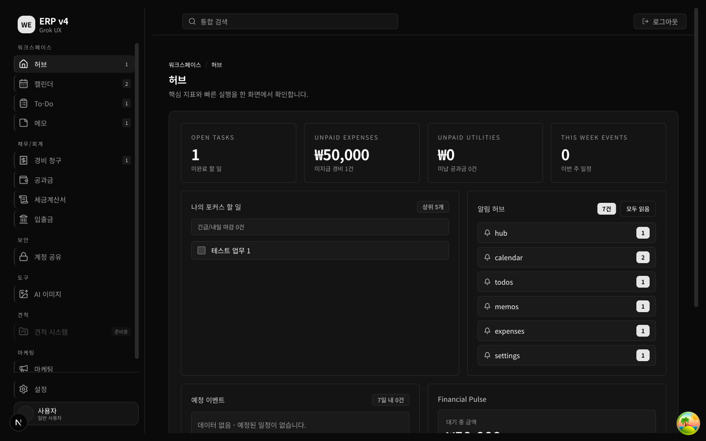
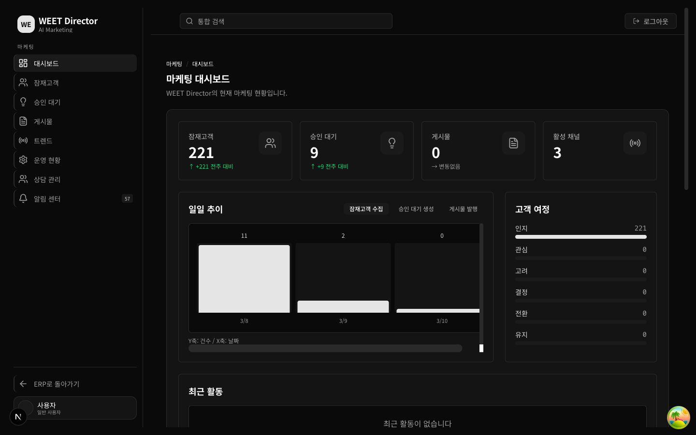
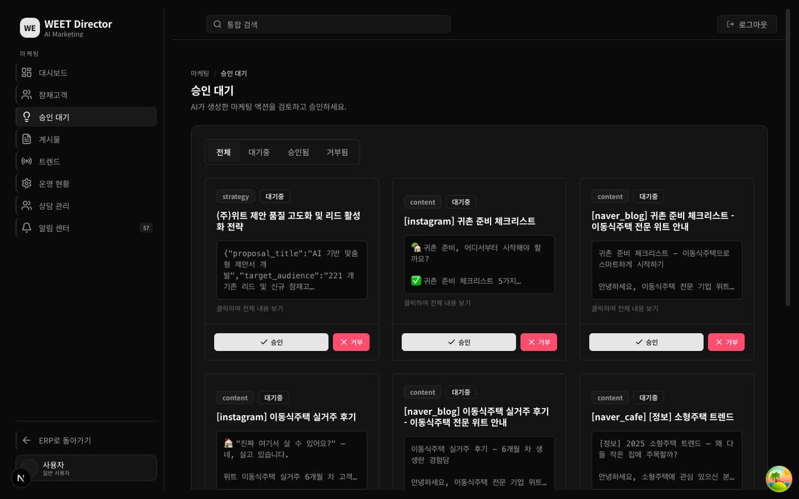
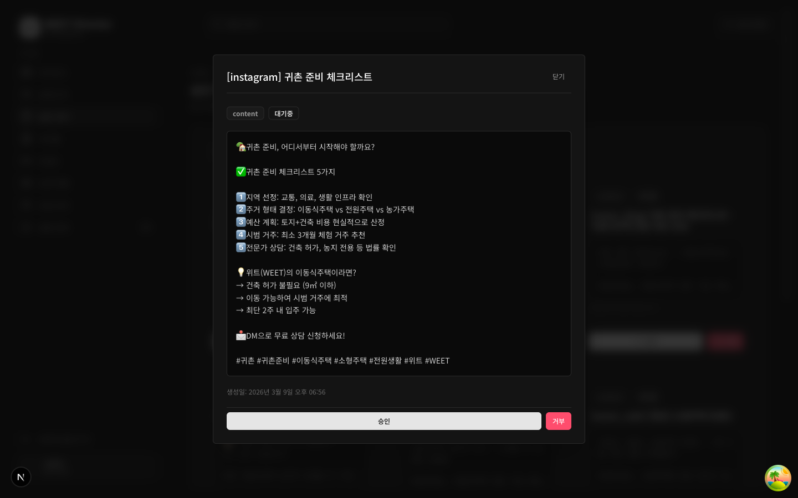
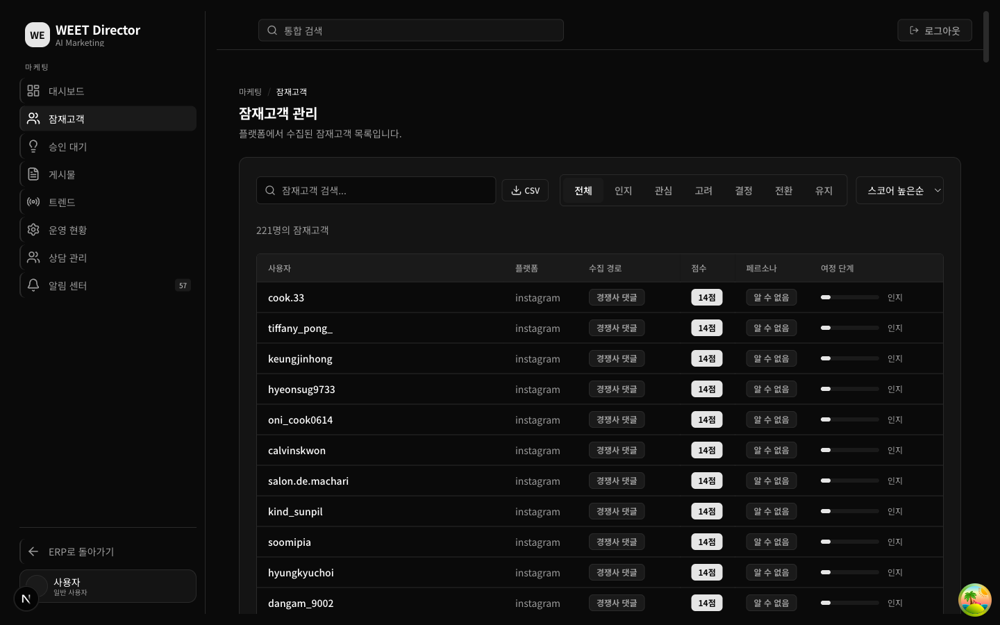
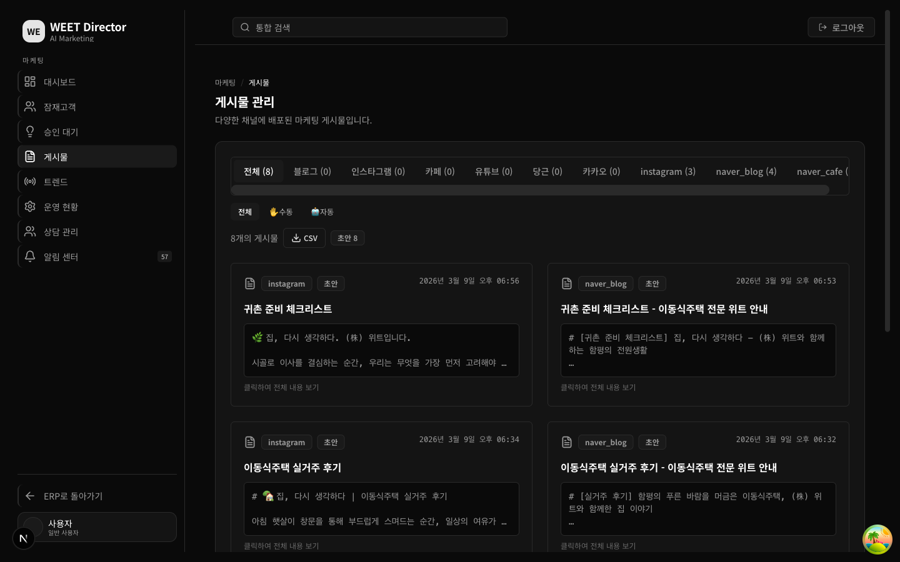
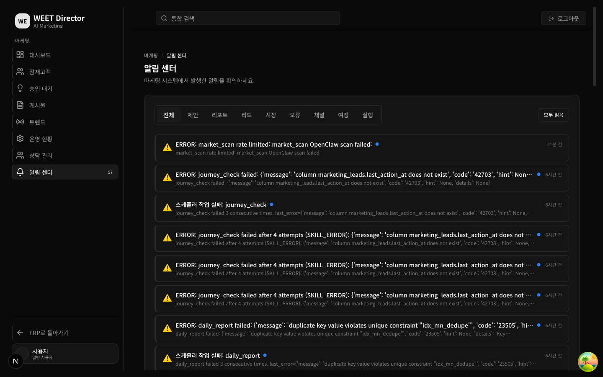

# WEET ERP v4 - 마케팅 자동화 시스템 데모

## 개요

WEET ERP v4는 (주)위트의 이동식주택 마케팅을 AI로 자동화하는 시스템입니다.

- **Python 백엔드**: 15개 스케줄러 Job이 매일 자동 실행 (리드 수집, 콘텐츠 생성, 시장 분석 등)
- **Next.js 프론트엔드**: 26개 페이지, 다크 테마 기반 대시보드
- **AI 엔진**: LMStudio (로컬 LLM) 기반 콘텐츠 생성 및 마케팅 전략 제안
- **데이터**: Supabase (PostgreSQL) 9개 테이블

---

## 주요 화면

### 1. ERP 허브 대시보드

전체 ERP 모듈을 한눈에 보는 메인 허브입니다. 워크스페이스, 재무/회계, 마케팅 등 모든 기능에 접근할 수 있습니다.



---

### 2. 마케팅 대시보드

마케팅 모듈의 핵심 지표를 요약합니다. 리드 수, 제안 현황, 채널별 통계, 최근 활동 내역을 실시간으로 확인합니다.



---

### 3. 승인 대기 (AI 제안)

AI가 자동 생성한 마케팅 콘텐츠 제안을 검토하고 승인/거부합니다. 인스타그램, 네이버 블로그, 네이버 카페 등 채널별 콘텐츠가 자동으로 초안 작성됩니다.



---

### 4. 제안 상세보기

카드를 클릭하면 AI가 작성한 전체 콘텐츠를 모달에서 확인하고, 바로 승인/거부할 수 있습니다.



---

### 5. 잠재고객 관리

다양한 플랫폼(Instagram, Naver Cafe, 당근마켓)에서 자동 수집된 221명의 잠재고객을 관리합니다. 여정 단계(인지→관심→고려→결정→전환)별 필터링, 스코어 정렬, CSV 내보내기를 지원합니다.



---

### 6. 게시물 관리

생성된 마케팅 게시물을 채널별로 관리합니다. 인스타그램, 네이버 블로그, 네이버 카페 등 채널 탭과 자동/수동 배포 필터를 제공합니다. 카드를 클릭하면 전체 내용을 상세보기할 수 있습니다.



---

### 7. 알림 센터

스케줄러 실행 결과, 오류, 일일 리포트 등 시스템 알림을 실시간으로 모니터링합니다. 카테고리별 필터(제안, 리포트, 리드, 시장, 오류, 채널, 여정, 실행)를 제공합니다.



---

## 기술 스택

| 구분 | 기술 |
|------|------|
| 프론트엔드 | Next.js 15, React 19, TypeScript, Tailwind CSS, Framer Motion |
| 백엔드 | Python 3.14, APScheduler, Supabase Python SDK |
| AI | LMStudio (로컬 LLM), 네이버 검색 API |
| DB | Supabase (PostgreSQL), 9개 마케팅 테이블 |
| 인프라 | launchd (macOS 스케줄러), Vercel (배포) |

## 자동화 파이프라인

```
[스케줄러] 매일 7시~23시 자동 실행
    ├── 리드 수집 (Instagram, Naver Cafe, 당근마켓)
    ├── 시장 트렌드 스캔
    ├── AI 콘텐츠 초안 생성 (블로그, 인스타, 카페)
    ├── 콘텐츠 발행 (승인된 항목)
    ├── 고객 여정 단계 업데이트
    ├── 참여도 분석 및 피드백
    └── 일일 리포트 생성
```

## 실행 방법

자세한 실행 방법은 [USAGE.md](USAGE.md)를 참고하세요.
